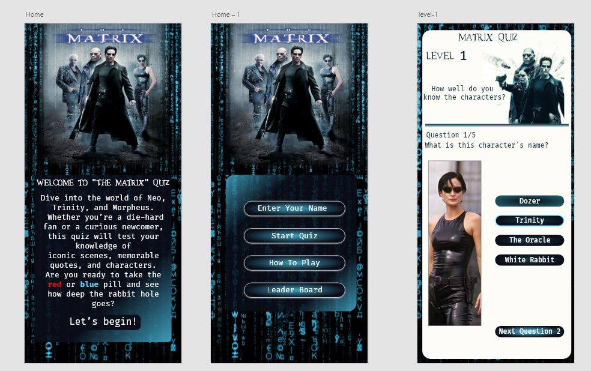
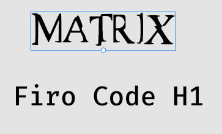

  

  

# The-Matrix-Movie-Quiz

[The Matrix Movie Quiz](https://samatkinsonmodeste.github.io/The-Matrix-Movie-Quiz/) 
website was greated for fans of the Matrix movies. Here is where you can test your knowledge on the charaters of the Matrix movies and reminisce the journey of all the characters and how they interacted. 

## Table of Contents

# UX

- [Goals](#goals)
   - [Users Story](#user-story)
   - [Vistor Goals](#vistor-goals)
  
- [Visual Design](#visual-design)
  - [High Fidelity Mockup](#high-fidelity-mockup)
  - [Fonts](#fonts)
  - [Colour Palette](#colour-palette)
  - [Styling](#styling)
- [Features](#features)
  - [Navigation Bars](#navigation-bars)
    - [Mobile Navigation](#mobile-navigation)
    - [Tablet Desktop Navigation](#tablet-desktop-navigation)
  - [Home Page](#home-page)
    - [Home Welcome Section](#home-welcome-section)
    - [Unwind Tranquillity](#unwind-tranquillity)
    - [Explore Escape](#explore-escape)
    - [Treatments Experts](#treatments-experts)
  - [Treatment Page](#treatment-page)
    - [Treatment Introduction](#treatment-introduction)
    - [Body Massages](#body-massages)
    - [Facial Massages](#facial-massages)
  - [Booking Page](#booking-page)
    - [Thank You For Booking Page](#thank-you-for-booking-page)
    - [Thank You For Booking Page More](#thank-you-for-booking-page-more)
  - [Footer](#footer)
  - [Technologies Used](#technologies-used)
    - [Languages](#languages)
    - [Other Tools](#other-tools)
  - [Testing](#testing)
    - [Methods](#methods)
      - [Validation](#validation)
      - [Accessibility](#accessibility)
      - [Mobile Testing](#mobile-testing)
      - [Desktop Testing](#desktop-testing)
  - [Bugs](#bugs)
    - [Known Bugs](#known-bugs)
    - [Fixed Bugs](#fixed-bugs)
- [Deployment](#deployment)
  - [Github Deployment](#github-deployment)
- [Credits](#credits)
- [Author](#author)

## Goals
### Users Story:
- #### Persona: Gina, a 40-year-old designer.
- #### Goal: As a movie enthusiast and fan of “The Matrix” series,
I want to play an engaging and challenging quiz about “The Matrix” movies,
so that I can test my knowledge and learn more interesting facts about the films and their characters.

## Vistor Goals
Game Goals:
- Multiple choice questions with answers tied to different Matrix characters.
- Dynamic quiz outcomes based on user responses.
- Responsive design for use on various devices (desktop and mobile).
- Real-time results after completing the quiz.

User Goals are:

- Test their knowledge of The Matrix movie characters.
- Learn about the characters and their names in the Matrix universe.
- Improve memory recall by recognizing familiar faces from the Matrix series.
- Compete for high scores by answering questions quickly and accurately.
- Explore the world of The Matrix in a fun and interactive way.

# Visual Design

## High Fidelity Mockup

  

## Fonts

  

The design of the Matrix Quiz app makes use of two distinct fonts to enhance the visual style and user experience:

## Matrix Font

  

- **Purpose:** This font is used to give the app an immersive Matrix feel. It is applied primarily to the quiz title, headings, and any Matrix-themed text within the app. 
 
  
-  **Design:** The Matrix font replicates the iconic aesthetic seen in the Matrix movie series, contributing to the overall atmosphere of the app and aligning it with the visual elements from the films.
- **Usage:** All headings and the main title on the landing page are rendered in the Matrix font to ensure users immediately recognize the theme.

## Firo Code Font

  

- **Purpose:** Firo Code is used for the app's body text, including instructions, quiz questions, and answer choices.

- **Design:** A clean and modern monospaced font, Firo Code enhances the readability of the text while giving a subtle tech-inspired feel that complements the futuristic design of the app.

- **Usage:** Body text and all other content, such as explanations and button text, are displayed in Firo Code to ensure clarity and a consistent coding aesthetic that fits well with the Matrix theme.

## Colour Palette

  

The following colors have been incorporated throughout the app to create contrast, highlight important elements, and add depth to the user interface.

1.**White:** `#FDFCF7`
- **Usage:** This soft white color is used as the primary background color, providing a clean and neutral canvas for the app's content. It ensures readability without straining the user's eyes. 
- **Purpose:** Balances the darker tones used elsewhere in the app, giving a clear and minimalistic backdrop.

2.**Contrast Color:** `#3f0359`
- **Usage:** This deep purple is used for contrast elements, such as and important text such as the questions. It brings boldness to key areas, highlighting the most crucial information.

- **Purpose:** Provides a strong contrast against lighter colors, making important text and UI components such as buttons stand out.

3.**Accent Colors:** `#3fa1bf` and `#4be9fb`

- **Usage:** These shades of blue serve as accent colors throughout the app. They're used for buttons, links, and hover states to draw attention to interactive elements.

- **Purpose:** Both blues offer a vibrant, modern touch that complements the tech-inspired theme of the Matrix series, while adding pops of color in a minimalistic way.

4.**Gradient Color:** `#13313a`

- **Usage:** This dark teal color is applied to gradient effects within the app, creating depth in backgrounds or overlays.

- **Purpose:** Adds dimension and smooth transitions between sections, enhancing the overall visual flow of the app without overwhelming the design.

5.**Black:** `#0a0e19`

- **Usage:** This deep, near-black color is used for the primary text and important base colour used for gradients.

- **Purpose:** A solid base color that adds contrast to the lighter hues, emphasizing the Matrix's dark and mysterious aesthetic while keeping a sleek, modern look.

## Styling

Although the focus was programming I still managed to add a fair bit of css.
 

# Features

## Navigation Bars

## Mobile Navigation

## Tablet Desktop Navigation

# Home Page

## Home Welcome Section

# Technologies Used

## Languages

- [HTML5](https://developer.mozilla.org/en-US/docs/Web/HTML)
  - Page Structure
- [CSS](https://developer.mozilla.org/en-US/docs/Web/CSS)

  - Page Styling

  ## Other Tools

  -

  # Testing

  # Methods

  ## Validation

 