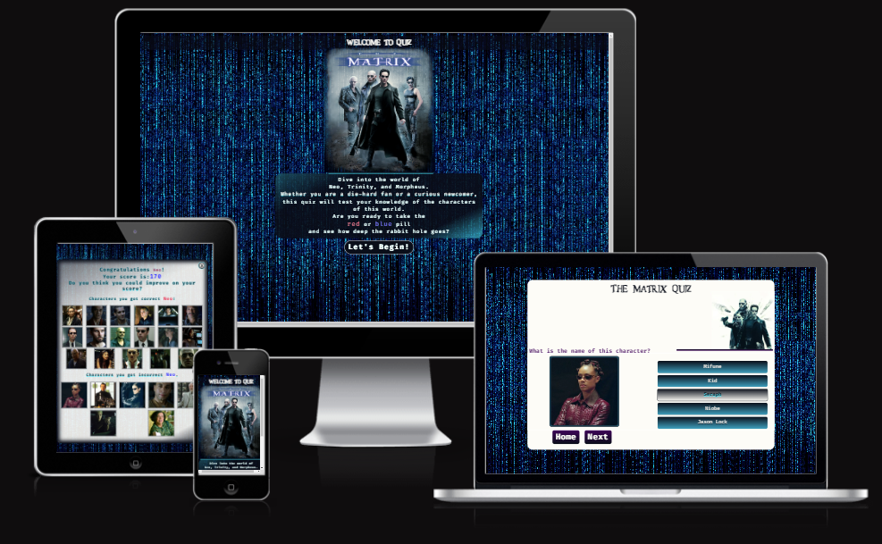
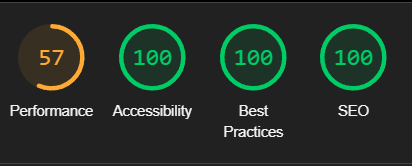

  

  

# The-Matrix-Movie-Quiz

[The Matrix Movie Quiz](https://samatkinsonmodeste.github.io/The-Matrix-Movie-Quiz/) 
website was greated for fans of the Matrix movies. Here is where you can test your knowledge on the charaters of the Matrix movies and reminisce the journey of all the characters and how they interacted. 

## Table of Contents

# UX

- [Goals](#goals)
   - [Users Story](#user-story)
   - [Vistor Goals](#vistor-goals)
  
- [Visual Design](#visual-design)
  - [High Fidelity Mockup](#high-fidelity-mockup)
  - [Fonts](#fonts)
  - [Colour Palette](#colour-palette)
  - [Styling](#styling)
- [Features](#features)
   - [Game Introduction Page](#game-introduction-page)
    - [Game Entry](#game-entry)
    - [Game Buttons](#game-buttons)
- [Overlays](#overlays)
    - [Overlay Score Display](#overlay-score-display)
    - [How to Play Overlay](#how-to-play-overlay)
    - [Overlay Play Again](#overlay-play-again)
  - [Technologies Used](#technologies-used)
    - [Languages](#languages)
    - [Platforms](#platforms)
    - [Other Tools](#other-tools)
  - [Testing](#testing)
    - [Methods](#methods)
      - [Validation](#validation)
      - [Accessibility](#accessibility)
      - [Mobile Testing](#mobile-testing)
      - [Desktop Testing](#desktop-testing)
  - [Bugs](#bugs)
    - [Known Bugs](#known-bugs)
    - [Fixed Bugs](#fixed-bugs)
- [Deployment](#deployment)
  - [Github Deployment](#github-deployment)
- [Credits](#credits)
- [Author](#author)

## Goals
### Users Story:
- #### Persona: Gina, a 40-year-old designer.
- #### Goal: As a movie enthusiast and fan of “The Matrix” series,
I want to play an engaging and challenging quiz about “The Matrix” movies,
so that I can test my knowledge and learn more interesting facts about the films and their characters.

## Vistor Goals
Game Goals:
- Multiple choice questions with answers tied to different Matrix characters.
- Dynamic quiz outcomes based on user responses.
- Responsive design for use on various devices (desktop and mobile).
- Real-time results after completing the quiz.

User Goals are:

- Test their knowledge of The Matrix movie characters.
- Learn about the characters and their names in the Matrix universe.
- Improve memory recall by recognizing familiar faces from the Matrix series.
- Compete for high scores by answering questions quickly and accurately.
- Explore the world of The Matrix in a fun and interactive way.

# Visual Design

## High Fidelity Mockup

  

## Fonts
The design of the Matrix Quiz app makes use of two distinct fonts to enhance the visual style and user experience:

### Matrix Font

  

- **Purpose:** This font is used to give the app an immersive Matrix feel. It is applied primarily to the quiz title, headings, and any Matrix-themed text within the app. 
 
  
-  **Design:** The Matrix font replicates the iconic aesthetic seen in the Matrix movie series, contributing to the overall atmosphere of the app and aligning it with the visual elements from the films.
- **Usage:** All headings and the main title on the landing page are rendered in the Matrix font to ensure users immediately recognize the theme.

### Firo Code Font

  

- **Purpose:** Firo Code is used for the app's body text, including instructions, quiz questions, and answer choices.

- **Design:** A clean and modern monospaced font, Firo Code enhances the readability of the text while giving a subtle tech-inspired feel that complements the futuristic design of the app.

- **Usage:** Body text and all other content, such as explanations and button text, are displayed in Firo Code to ensure clarity and a consistent coding aesthetic that fits well with the Matrix theme.

## Colour Palette
The following colors have been incorporated throughout the app to create contrast, highlight important elements, and add depth to the user interface.

  

 

1.**White:** `#FDFCF7`
- **Usage:** This soft white color is used as the primary background color, providing a clean and neutral canvas for the app's content. It ensures readability without straining the user's eyes. 
- **Purpose:** Balances the darker tones used elsewhere in the app, giving a clear and minimalistic backdrop.

2.**Contrast Color:** `#3f0359`
- **Usage:** This deep purple is used for contrast elements, such as and important text such as the questions. It brings boldness to key areas, highlighting the most crucial information.

- **Purpose:** Provides a strong contrast against lighter colors, making important text and UI components such as buttons stand out.

3.**Accent Colors:** `#3fa1bf` and `#4be9fb`

- **Usage:** These shades of blue serve as accent colors throughout the app. They're used for buttons, links, and hover states to draw attention to interactive elements.

- **Purpose:** Both blues offer a vibrant, modern touch that complements the tech-inspired theme of the Matrix series, while adding pops of color in a minimalistic way.

4.**Gradient Color:** `#13313a`

- **Usage:** This dark teal color is applied to gradient effects within the app, creating depth in backgrounds or overlays.

- **Purpose:** Adds dimension and smooth transitions between sections, enhancing the overall visual flow of the app without overwhelming the design.

5.**Black:** `#0a0e19`

- **Usage:** This deep, near-black color is used for the primary text and important base colour used for gradients.

- **Purpose:** A solid base color that adds contrast to the lighter hues, emphasizing the Matrix's dark and mysterious aesthetic while keeping a sleek, modern look.

## Styling
### CSS Features
- **Flexbox:**

  - Used Flexbox for building responsive and flexible layouts.

  - Ensured proper alignment of quiz components such as images, buttons, and text within containers for a consistent look across devices.

  - Applied Flexbox for both horizontal and vertical centering, improving the layout structure for different screen sizes.

- **Linear Gradients:**

  - Utilized linear gradients to create smooth transitions between background colors, adding depth and visual appeal to various sections of the app.

  - Applied gradients for elements like buttons and headers to emphasize interaction points and enhance the futuristic aesthetic.

- **Text Shadow:**

  -  Added subtle text shadows to quiz headings and key text elements to enhance readability and provide a more immersive experience.

  - Used shadows sparingly to maintain a balance between visual effect and legibility.

- **Media Queries:**

  - Implemented responsive design with media queries to ensure the app works smoothly across various screen sizes, including mobile, tablet, and desktop devices.

  - Adjusted layout, font sizes, and spacing to maintain usability and readability on smaller screens.

# Features

### Game Introduction Page

  

The Matrix Quiz begins by immersing mentioning the three key characters.  A brief explanation follows, informing the user that they are about to embark on a quiz adventure.  Using the iconic choice from the Matrix, the user is asked if they are ready to take the _blue or red pill_.  If the user decides to take the pill they can proceed down the rabbit hole by clicking the Let's Begin button which takes them to the game entry point. 

### Game Entry

  

At the entry point of the Matrix Quiz, players are presented with two buttons and an input field.  The input field is used to enter the player's name, which is required to start the quiz. 
If a player clicks the **Start Quiz** button without typing their name. 
A pop-up alert box pops up.

  

The _How To Play_  button opens an overlay with detailed instructions on how to play the game, along with the rules.
The _Start Quiz_ button is used to start the quiz. However, if the player has not entered their name, a pop-up alert will inform them that the name is required, and the quiz will not begin until the name is provided.

  

## Game Buttons
In the Matrix Quiz, users interact with several buttons to navigate and complete the quiz:

- **Five character named buttons:**
  -  These buttons display different character names, and the user selects one to guess the correct name of the character shown in the image. When a button is selected, it changes colour to indicate the user's choice.

  

  

- **Home button:**
  -  This button allows the user to return to the game entry point, where they can restart or adjust their setup.

  

  

- **Next button:**
  - After choosing a character name, clicking the Next button will take the user to the next question in the quiz.

- **Submit button:** 
  -  Once all questions have been answered, a Submit button appears, allowing the user to submit their answers for final evaluation.

  

  

These buttons provide a simple and engaging way to navigate through the quiz.

## Overlays

### Overlay Score Display

At the end of the Matrix quiz, an overlay is displayed showing the player's final score. This overlay provides a clear summary of the quiz results with the following elements:
- **Personalized Congratulations Message:**
The overlay greets the player with a customized congratulations message that includes their name, which was entered at the start of the quiz. For example, _"Congratulations, [Player's Name]!"_ is dynamically displayed to make the score page feel more engaging and personalized.
- **Score Summary:**
The player's final score is displayed, showing how many characters they identified correctly.
- **Correct Character Images:**
The overlay displays the images of the characters the player guessed correctly. 
- **Incorrect Character Images:**
For any questions the player answered incorrectly, the overlay shows the images of the incorrect characters. 

  

### How to Play Overlay
The "How to Play" overlay provides players with clear instructions and rules before they begin the Matrix quiz.  This overlay ensures that users understand how the game works and sets expectations for the gameplay.

  

### Overlay Play Again
At the conclusion of the Matrix quiz, players are presented with a "Play Again or Exit Game" overlay that offers a simple and intuitive choice for what they’d like to do next. This overlay enhances the user experience by providing clear options for continuing or ending their game session.

  

# Technologies Used

## Languages

- [HTML](w3.org/standards/webdesign/htmlcss)
    * Page markup.
- [CSS](w3.org/standards/webdesign/htmlcss)
    * Styling.
- [Javascript](https://developer.mozilla.org/en-US/docs/Web/JavaScript)
    * Running functions for interactive components.

    ## Platforms
- [Github](https://github.com/)
    * Storing code remotely and deployment.

  ## Other Tools
- [Adobe XD](https://adobe-xd.en.softonic.com/)
     * To create the High Fidelity mock-ups.
- [Favicon](https://www.favicon-generator.org/)
    * Creates multiple favicons from a single image to cater to diverse browsers and devices.

  # Testing

  ## Methods

  ### Validation

   - All HTML files validated with [W3C Markup Validation Service](https://validator.w3.org/)

    - 

        
      

- Stylesheet validated with [W3C CSS Validation Service](https://validator.w3.org/)

   

      
    

  - Javascript file was tested on the site for errors and functionality using the console and with [JSHint](https://jshint.com/).

     

      
     

    ### Accessibility
    To ensure that the Matrix quiz web page is accessible to all users, including those with disabilities, I utilized the following tools:
1. WAVE (Web Accessibility Evaluation Tool):
WAVE was used to evaluate the accessibility of the web page by identifying issues related to:

   - Contrast errors
   - Missing alternative text for images
   - Structural elements, such as headings and labels
   - ARIA (Accessible Rich Internet Applications) support

By running the page through WAVE, I was able to detect and address these issues to improve the overall accessibility of the site.

  

      
  

2. Chrome Lighthouse:
Chrome Lighthouse was used to further audit the web page's accessibility. Lighthouse provided insights and scores based on the following criteria:

- Text legibility and color contrast ratios
- Proper use of semantic HTML elements
- Accessible navigation and focus management
- Support for screen readers and keyboard navigation

Lighthouse's automated testing helped ensure that the web page follows best practices for accessibility, providing a more inclusive experience for all users.

 

      
  

  #### Mobile

  

      
  

   #### Desktop

  

      
  

  ### Mobile Testing
  - I tested the site personally on my iPhone device, and played through the game twice.
- The site was sent to friends for them to play. They have tested on their devices, including Andriod.
- Chrome was utilised to inspect the site in mobile format, playing through the quiz.

### Desktop Testing
#### PC
- The site was tested on a PC running Windows using the latest version of Google Chrome.
- Also on a PC running Windows the latest version of FireFox Nightly.
- As well on a PC running Windows the latest version of Microsoft Edge

All to ensure cross-browser compatibility.

### Mac Laptop
-  The site was also tested on a Mac laptop, in Chrome.

# Bugs

### Known Bugs
- Glitch with the container for the image of the characters when the next question is loaded.
- When the pop-up alert appears when a user hasn't input a name the input is not disabled
- Results page is slight off center.

### Fixed Bugs

- Player was able to click on all the inputs, which would duplicate the images on the results page.
  -  Fixed by creating nested for loops to disable all inputs once one was clicked.
- When the alert pop-up alert user to input a name when the alert close button was clicked the quiz container class hidden would be removed as if the start button had been clicked. 
   - Fixed by creating an event listner on the closing alert button and disabling the start button.
- Each character image was only being pushed to the correct image array and not the incorrect image array. So the results page would display the same images for correct and incorrect.
  - Fixed by creating a function that takes an array and pushes items to the array given as the argument.

  # Deployment

  ### Github Deployment
  - Anyone can clone and download the quiz.
  **Requirements are:**
  - A Email Account
  - A free GitHub account

### Github Instructions
1. Log in to your GitHub account.
navigate to [https://github.com/SamAtkinsonModeste/The-Matrix-Movie-Quiz](https://github.com/SamAtkinsonModeste/The-Matrix-Movie-Quiz).
1. You can set up your own repository and copy or clone it, or you fork the repository.
2. `git add`, `git commit` and `git push` to a GitHub repository, if necessary.
3. GitHub pages will update from the master branch by default.
4. Go to the **Settings** page of the repository.
5. Scroll down to the **Github Pages** section.
7. Select the Master Branch as the source and **Confirm** the selection.
8. Wait a minute or two and it should be live for viewing

## Credits

### Tutorial
#### JavaScript
I referenced an excellent tutorial by Kyle Cook from Web Dev Simplified [Kyle Cook's Build A Quiz With JavaScript](https://www.youtube.com/watch?v=riDzcEQbX6k), which provided a clear introduction to creating an interactive quiz using JavaScript. 
I used Kyle Cook's tutorial as the starting point for my project, basing my initial programming on his simple demo. From there, I expanded upon the demo by:

- Adding more advanced functionality, such as overlays for displaying "How to Play" instructions, score summaries, and replay options.
- Personalizing the quiz by dynamically inserting the player's name and feedback based on their answers.
- Incorporating visual feedback through character images for correct and incorrect answers.
- Enhancing the user experience with additional features, responsiveness, and customized pop-ups.

Kyle's tutorial provided a strong foundation that allowed me to build upon and create a more complex, engaging, and interactive quiz.

### Text Content
- As someone who struggles with dyslexia, I relied on [Grammarly](https://app.grammarly.com/) for grammar and spelling support. Their AI also helped me enhance the overall wording of some of my text.

For additional text content in my Matrix quiz game, I utilized [ChatGPT](https://chatgpt.com/), an AI language model developed by OpenAI. ChatGPT assisted me in crafting various aspects of the quiz, including:

- The "How to Play" instructions that guide users through the game mechanics.
- The personalized congratulations messages displayed at the end of the quiz.

Using this approach allowed me to focus more on the technical and interactive aspects of the project while ensuring the text content was both polished and cohesive.

## Author

- Twitter - [@sammodeste1](https://www.twitter.com/@sammodeste1)
- LinkedIn - [Sam-Atkinson-Modeste](www.linkedin.com/in/sam-atkinson-modeste)
- GitHub - [SamAtkinsonModeste](https://www.github.com/SamAtkinsonModeste)

.

